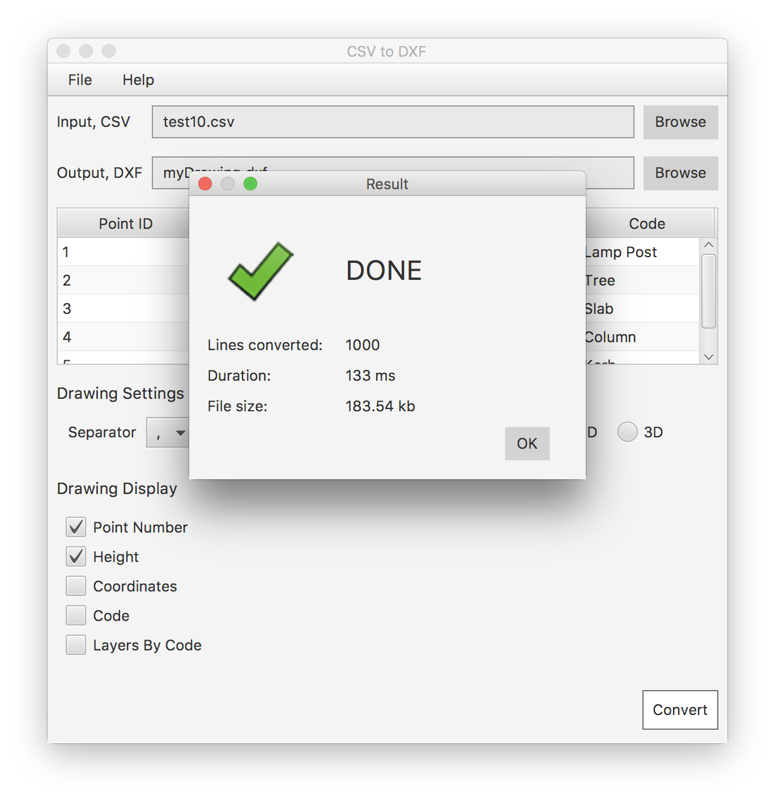

# csv to dxf

This tool converts a list of comma separated coordinate pairs and point numbers to a dxf drawing.

**CSV file structure:**  
P,E,N,H,C

- `P` - point number/name
- `E`, `N` - **E**asting, **N**orthing coordinates
- `H` - **H**eight (optional), (0.0 by default)
- `C` - **C**ode (optional)

The program has a GUI.
To use the program:
- Build the project from source
- or Download it from [here]() for your operating system.

### Features

- 5 line preview of the selected input file  
- **Drawing Settings**
  - Value separator can be `,` or `;`
  - Text height: a decimal number to match your target drawing scale/text height
  - Mode: `2D` | `3D` when 2D is chosen: all drawing elements will have the height: `0.0` however the height text property still can display the height.  
- **Drawing Display**
  - Can choose to display the following propeties:
    `Point ID`, `Height`, `Coordinates`, `Code or description`
  - `Layers by code` overrides the default setting and places all drawing elements to a layer named by the code property of a line, if not specified the layer name will be `Unknown_Code`
- By default the drawing elements will be respectively on layers named as: `Point`, `Point_Id`, `Height`, `Coords`, `Code`.
- Ignores empty lines, and trims whitespace from each column.
- As a point marker it produces a `point` entity.
 

